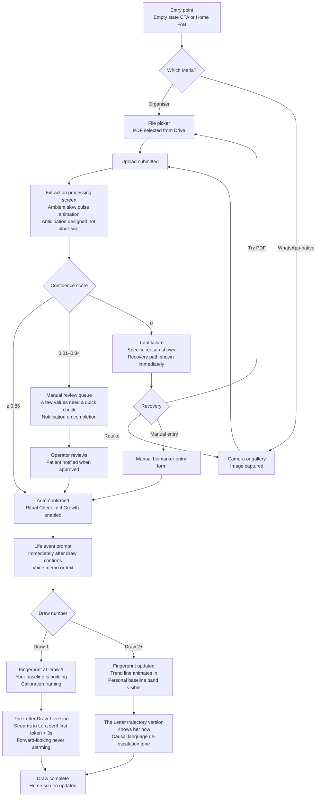
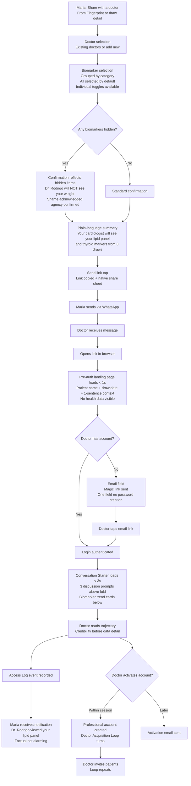
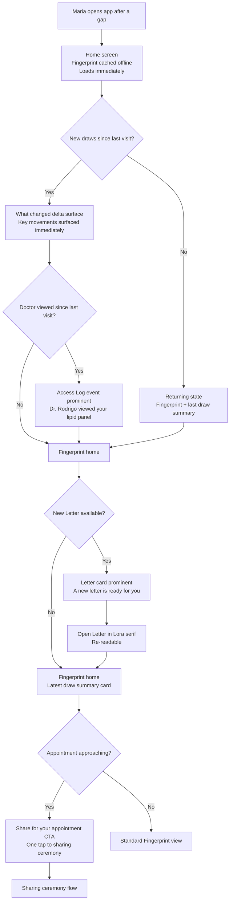
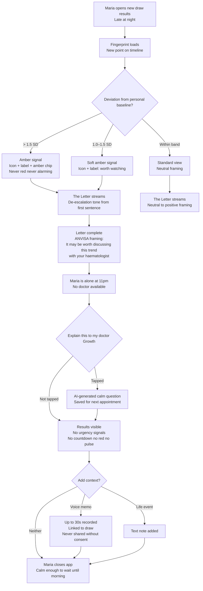

# UX Design Specification Health Tracker

**Author:** Francis
**Date:** 2026-05-13

---

<!-- UX design content will be appended sequentially through collaborative workflow steps -->

## Executive Summary

### Project Vision

Health Tracker is a patient-owned longitudinal health record for Brazil's 50M private health consumers — the first product to unify blood tests (LOINC-normalized from any Brazilian lab), bioimpedance, and skinfold data under patient control. The defining value: patients arrive at every specialist appointment as the most informed person in the room, with a personal health trajectory no doctor has ever been able to give them. The product's growth engine is the Doctor Acquisition Loop — patients share a record, doctors open a clean Conversation Starter in 90 seconds without installing anything, doctors activate accounts, doctors invite other patients. The 2028 government health unification target defines the window.

### Target Users

**Maria — The Organiser** (primary): Google Drive mental model; has a folder structure; already believes her records matter and is frustrated they're scattered. PDFs are the natural input format.

**Maria — The WhatsApp-native** (primary): Ephemeral capture mental model; photos everything, forgets the file exists, navigates by recency and chat history. Doesn't yet believe she *has* a longitudinal health record worth owning. The UX must build that belief — this is a motivation gap, not a file format problem.

**Doctor / Specialist** (secondary): Endocrinologist, cardiologist, sports medicine physician. Receives a patient-initiated no-install link. First question: *"who sent this and why should I trust it?"* — not *"what am I looking at?"* The 90-second experience is a credibility problem, not a comprehension problem.

**Health Professional** (tertiary): Nutritionist, personal trainer — works longitudinally with body composition, high session frequency, no current digital home for results.

### Key Design Challenges

**C1 — The wait experience.** The 10–30 seconds between upload submission and extraction result is not a technical threshold — it's an anticipation surface. A human is standing at the kitchen counter waiting. Anxiety lives here, or trust is built here. Currently undesigned.

**C2 — The post-upload gap.** The seconds between "upload complete" and "The Letter arrives" are a live drop-off risk. This gap needs a designed experience, not a spinner.

**C3 — Total extraction failure.** Confidence <0.85 triggers the manual review queue. Confidence = 0 (blurry photo, wrong document type) is a cliff edge. These are different problems requiring different design responses.

**C4 — Fingerprint cold start.** Draw 1 has no personal baseline to compute from. "Value must feel immediate" is aspiration — the design must specify *which* value, exactly, is delivered at Draw 1 to make this concrete.

**C5 — Two Marias as a mental model gap.** The Organiser already believes her records have narrative continuity. The WhatsApp-native doesn't yet own that story about herself. This is not an upload flow routing problem — it's an onboarding belief gap that propagates downstream into notifications, history navigation, and re-sharing.

**C6 — The Doctor screen as a trust and credibility problem.** The Conversation Starter must answer "why should I trust this?" before "what does this mean?" The 90-second framing is about credibility, not comprehension.

**C7 — The Letter as a high-risk design surface.** Streamed health narrative can feel like magic or manipulation depending on execution. The design language for when The Letter has to say something hard — a persistent out-of-range trend, a significant deviation — is as important as the delight case. This is a risk, not just an opportunity.

**C8 — Sharing as social performance.** When Maria selects which biomarkers to share before an appointment, she's not only protecting data — she's deciding how to present herself to her doctor. She may hide a result out of embarrassment or to control the narrative. This is a shame-and-agency moment disguised as a settings screen, and it needs to be designed as such.

**C9 — Privacy as ongoing emotional texture.** The challenge is not "make the Access Log visible." It is "make the patient feel protected through the texture of every interaction" — the way a good coat fits, not the way a privacy policy reads.

**C10 — The returning visit.** Maria opens the app six weeks after her first draw, two days before her next appointment. She needs to know in ten seconds what changed and why it matters. This is arguably the most-used surface in the product and currently has no representation in the design framing. The longitudinal promise lives here.

**C11 — The post-doctor-view loop.** After a doctor opens the Conversation Starter and views biomarkers — does Maria know? Does she see what the doctor focused on? The loop back from doctor to patient is a sovereignty moment that currently falls off the edge of the framing.

**C12 — The 11pm frightening result.** Maria receives a result that scares her. It is late. There is no doctor available. The app is the only thing in the room. "Bad results are not bad news" is either a design principle or a prayer — this scenario is where it gets tested.

### Design Opportunities

**O1 — The upload ritual.** The upload ceremony, the wait experience, and the Ritual Check-In (pre-results emotional state capture) together form the product's most distinctive onboarding moment. Design it like a threshold crossed, not a form submitted.

**O2 — The Letter as signature experience.** Streamed personal health narrative, first token in under 3 seconds. The magic case and the hard case both need design — the hard case may be the more important one.

**O3 — The empty state as first vulnerability moment.** A brand-new user's first screen, before any data exists, is where she decides whether this product is worth the vulnerability of putting her health history somewhere. It carries the product's entire promise and deserves intentional design, not a generic onboarding illustration.

**O4 — Sharing as a journey.** The moment between "I received my results" and "I decided what my cardiologist gets to see" is the product's most emotionally loaded interaction. Designing this as a journey — not a settings screen — is where patient sovereignty becomes something Maria can feel, not just read about.

**O5 — The returning visit.** Draw 3. Draw 8. The app already knows Maria. The trend lines are visible. The Letter has changed tone. Designing the re-entry experience — "here's what moved since last time and here's why it might matter" — is where the longitudinal value proposition becomes visceral and irreversible.

**O6 — The Access Log as ongoing trust anchor.** The Access Log is most powerful not at first encounter but in the returning visit — when Maria checks back and sees exactly who has seen what. Making this beautiful and primary signals that this product was built around her, not around the data.

## Core User Experience

### Defining Experience

The product's most critical interaction is the Doctor Conversation Starter — the authenticated web link a patient shares that a doctor opens and acts on within 90 seconds of receiving it. This is simultaneously the product's growth engine (the Doctor Acquisition Loop) and its credibility test with every new physician who receives one. All patient-side design — the upload ritual, The Letter, the Fingerprint, the sharing flow — exists in service of making this moment possible, trustworthy, and repeatable.

The patient-side defining experience is the Longitudinal Fingerprint at Draw 2+: the first time Maria sees herself over time, computed against her own baseline, not a population range. This is the aha moment that converts a first-time uploader into a retained user.

### Platform Strategy

**Patient experience — mobile-first:**
Expo + React Native (iOS 16+ / Android 13+) with Next.js web as secondary access. The primary patient interaction context is a phone — uploading a lab PDF or photo, reading The Letter, reviewing the Fingerprint, initiating a doctor share. All core flows must be designed for one-handed mobile use first.

**Doctor experience — responsive web, desktop primary, authentication required:**
The Conversation Starter is a Next.js web page opened via a shared link, no app install required. Authentication is required before any patient health data is displayed. The pre-auth landing page shows only the patient's name and share context (a lightweight static shell). Once authenticated — via fast registration or login — the report loads within 90 seconds of the doctor receiving the link. Expected context is a desktop browser in a clinic; the link must also render correctly on mobile. The doctor registration/login step is a critical conversion screen and must be treated with the same care as a checkout flow.

**Upload path — intentional now, automatic later:**
MVP upload is intentional and patient-initiated: PDF file picker or camera capture. The future direction is automatic ingestion — email forwarding, lab API partnerships. Entry points and confirmation flows should feel like "I'm adding this to my record" rather than "I'm filing this," so the transition to automatic ingestion feels like a natural upgrade.

**Offline:**
Fingerprint and historical draw data cached for offline read access. Upload and doctor share links require connectivity.

### Effortless Interactions

- **Upload should feel like pointing a camera, not filling a form.** The WhatsApp-native Maria photographs a result; the experience from camera to "processing" should be two taps.
- **The Conversation Starter landing page must make registration feel like one step, not a gate.** A doctor who hits friction before seeing any value will not convert. Magic link is the MVP auth pattern; social login is post-MVP.
- **Per-biomarker sharing selection requires no more than three taps from the Fingerprint view.** The path from "I want to share with my cardiologist" to "link sent" must not feel like configuring a permissions panel.
- **The doctor never waits more than 3 seconds for the report after authenticating.** The pre-auth shell is static and instant; the report loads immediately on auth completion.

### Critical Success Moments

**The doctor's 90-second conversion:** A doctor opens a patient link, sees a pre-auth landing page (name + context only), completes a fast registration or login, and reaches the Conversation Starter report — all within 90 seconds of tapping the link. The report answers "why trust this?" before "what does this mean?" — credibility first, comprehension second. This is the highest-stakes conversion screen in the product.

**Maria's second draw:** The Fingerprint shows a trend line. The Letter changes tone — it knows her now. This is the moment the product stops being a storage tool and becomes a longitudinal companion. It must feel like recognition, not data.

**The sharing decision:** Maria selects which biomarkers her cardiologist gets to see. She submits the share and feels that she just chose what story to tell. This moment — not the Access Log settings page — is where patient sovereignty becomes tangible.

**The bidirectional loop closed:** A doctor sends an exam request (quest); Maria completes it; the result auto-appears in the shared record. The product is no longer one-directional. This is the moment the doctor-patient relationship has a digital home.

### Experience Principles

1. **The doctor experience is the growth lever.** Patient-side design serves it. When a design decision must trade off between patient delight and doctor conversion, understand what it costs.
2. **The Conversation Starter registration is a conversion flow, not a form.** Minimise fields, maximise speed, and show enough context before the gate that the doctor already wants to proceed.
3. **Upload is intentional today; automatic is the direction.** Every upload entry point should feel like "I'm adding this to my record" so the transition to automatic ingestion feels like a natural upgrade, not a product change.
4. **Every tap between "I want to share" and "doctor has access" is a drop-off risk.** The sharing journey must be designed for minimum friction while preserving the feeling of intentional consent.
5. **Credibility before comprehension in the doctor flow.** Trust is established in the first 10 seconds of the Conversation Starter or not at all. Design the header and source signal before the biomarker cards.

## Desired Emotional Response

### Primary Emotional Goals

**Patient north star — Seen.**
"Something finally knows my trajectory, not just my last result." This is the feeling that no Brazilian private health consumer has ever had from a product. Every lab portal, every EMR, every PDF folder fails at this. Health Tracker succeeds when Maria opens the Fingerprint at Draw 2 and feels *recognised* — not processed, not warned, not evaluated against a population. Her own arc is reflected back to her.

**Doctor north star — Relieved.**
"I don't have to reconstruct her history from scratch." The Conversation Starter removes the cognitive tax of history-taking. The doctor walks into the consultation already knowing what changed. Relief — not impression, not admiration — is the emotion that converts a doctor into a distribution node. A doctor who feels relieved will want every patient to use this.

### Emotional Journey Mapping

| Moment | Target emotion | Emotion to avoid |
|---|---|---|
| Empty state (zero uploads) | Curious, gently invited | Intimidated, overwhelmed |
| Upload initiation | Purposeful, threshold-crossing | Clerical, form-filling |
| Extraction wait (10–30s) | Anticipation, trust building | Anxiety, doubt |
| Extraction failure / low confidence | Understood, helped | Embarrassed, blocked |
| Fingerprint at Draw 1 | Hopeful — something is being built | Disappointed by incompleteness |
| Fingerprint at Draw 2+ | **Seen** — the aha moment | Alarmed, judged |
| The Letter (first read) | Warm recognition, narrative identity | Clinical detachment |
| Bad result at 11pm | Calm enough to wait until morning | Panic, helplessness, urgency |
| Sharing decision | Sovereign — I chose what my doctor sees | Surveilled, coerced |
| Returning visit | Continuity — this record knows my arc | Forgotten, starting over |
| Doctor pre-auth landing | Intrigued — worth 60 seconds to register | Suspicious, annoyed |
| Doctor post-Conversation Starter | **Relieved** — history already present | Overwhelmed, sceptical |

### Micro-Emotions

**Trust vs. Scepticism** — built through: Access Log transparency (I can see who saw what), personal baseline framing (not alarming population comparisons), and The Letter's warm non-clinical voice. Scepticism enters when the product feels like surveillance rather than advocacy.

**Curiosity vs. Dread** — the central reframe of the entire product. Blood test results are not "what's wrong with me." They are "what's changed in me." Every copy choice, every colour decision, every framing of an out-of-range value is an opportunity to reinforce curiosity over dread.

**Agency vs. Helplessness** — Maria chose to upload. She chose which biomarkers to share. She can revoke access at any time. She added the life event note that explains the spike. The product must continuously signal that she is the one acting on this data, not the data acting on her.

**Recognition vs. Anonymity** — the antidote to "53% of Brazilians feel the health system treats them like a number." The Letter, the personal baseline, the voice memo, the life event overlay — every personalisation layer is a recognition layer.

### Design Implications

**Seen → Recognition before information.**
The Letter must open with something that signals the product knows Maria's arc before it lists biomarkers. The Fingerprint must show personal baseline context before individual values. Life event overlays and voice memos are meaning-making tools, not optional features — they are the mechanism through which the product feels like it knows her.

**Calm at 11pm → De-escalation is the default register.**
When a result is out of range, when The Letter has to address a declining trend, when a value sits 2+ standard deviations from personal baseline — the product's tone must hold the anxiety, not amplify it. "It may be worth discussing this trend with your doctor or a haematologist" at 11pm should feel like a thoughtful friend's voice, not a hospital alarm. No countdown timers. No red banners. No urgency signals. The ANVISA "direction, not diagnosis" framing is not just a compliance requirement — it is the emotional design brief for the hardest moments.

**Relieved (doctor) → Front-load context, defer detail.**
The Conversation Starter must lead with "here's what changed since last time" before surfacing individual biomarker cards. The doctor's cognitive relief comes from understanding the narrative arc in 10 seconds, not from reading a table of values. Patient name, visit context, and the three discussion prompts must be visible immediately after authentication. Data comes second.

**Sovereign → Sharing as ceremony, not settings.**
The moment Maria selects which biomarkers to share is not a configuration screen — it is the product's most emotionally loaded interaction. The design must frame it as a deliberate act of agency: "here is what I'm choosing to bring into this appointment." Confirmation language should reflect choice, not compliance.

### Emotional Design Principles

1. **Recognition before information.** The product signals it knows Maria's trajectory before surfacing individual data points. Narrative context precedes values.
2. **De-escalation is the default register.** When uncertainty or difficulty is present — bad result, 11pm moment, low-confidence extraction — the product's tone dampens anxiety. It never amplifies.
3. **The doctor's relief is the patient's success.** Maria's sovereignty and the doctor's cognitive load reduction are aligned, not competing. Design that serves one serves both.
4. **Curiosity is the reframe for health data.** Results are not verdicts. They are signals of change. Every copy and visual choice consistently chooses curiosity over dread, trajectory over threshold.
5. **Visibility creates safety, not surveillance.** Being known by the product feels like recognition. Being seen by others must feel controlled and chosen. The Access Log is the mechanism that keeps these two feelings distinct.

## UX Pattern Analysis & Inspiration

### Inspiring Products Analysis

#### Nubank — Radical transparency, plain-language finance, frictionless trust

Nubank built Brazil's first financial product that made people feel in control of something that had always felt opaque and hostile. The relevant patterns for Health Tracker:

**Transparency as primary UI, not settings.** Nubank's spending breakdown is on the home screen, not buried in reports. Every transaction is immediately visible, categorised, and named plainly. The Access Log has the same design brief — it belongs on a primary surface, not a privacy settings page.

**Plain-language framing of complex data.** Nubank turned banking jargon into language that 25-year-olds in favelas could understand. Health Tracker must do the same for biomarkers — "your ferritin (iron stores)" not "serum ferritin 47 ng/mL."

**Frictionless registration as a growth mechanic.** Nubank's account activation — famously fast, mobile-only, no branch visit — is the template for the doctor Conversation Starter registration flow. The doctor sees enough value in the pre-auth landing page that registration feels like the obvious next step.

**Notifications that inform, never alarm.** "Você gastou R$45 no iFood" is factual, contextual, not judgmental. Health Tracker's push notifications ("your new results are ready") must follow the same register — never "⚠️ abnormal value detected."

#### Strava — Personal records computed from your own history, not the population's

Strava solved the same philosophical problem as Health Tracker: how do you make individual progress meaningful without comparing people to others who aren't them? The personal record (PR) — computed against your own history — is the Longitudinal Fingerprint in running form.

**Personal records = personal baseline.** A Strava PR is meaningless against a world record but enormously meaningful against your own August time. The Fingerprint's personal z-score is the same mechanic — your ferritin at 47 is alarming against *your* 88 baseline, unremarkable against a population range.

**Privacy zones = per-biomarker sharing controls.** Strava lets athletes hide specific activities near their home without hiding everything. This is the mental model Maria needs: "my lipid panel is visible to my cardiologist; my weight is not."

**The returning visit surface.** Strava's activity feed answers "what happened since I last opened this" in three seconds. The Health Tracker returning visit (C10) needs the same — "what changed since your last draw" as the primary re-entry view.

**The Year in Sport = The Letter timing model.** Strava's annual retrospective works because it appears *once*, at the right moment, and feels like a gift rather than a report.

#### WHOOP — Personal baselines, journal context, coach narrative

WHOOP is the closest product analogue — longitudinal personal health data, no absolute thresholds, everything relative to your own body.

**The calibration period addresses the cold start honestly.** WHOOP's first 30 days are framed as baseline establishment — "your WHOOP is learning your body." Users accept an incomplete experience because the product explains what it's building toward. Health Tracker's Draw 1 Fingerprint screen needs this same framing.

**The journal = life event overlays + voice memos.** WHOOP's journal prompt appears at the right moment (after a score appears), not as a standalone feature to discover. Health Tracker should prompt life event entry immediately after a new draw confirms.

**Coach insights = The Letter's format model.** WHOOP's daily recovery explanation uses "because" language rather than bare data. The Letter must similarly use causal, narrative language — not "your ferritin is 47" but "your ferritin has declined steadily across three draws, which may explain the energy dip you noted in November."

**No absolute thresholds, all relative.** WHOOP never tells you "you slept badly." It tells you "you got 68% of your sleep need." Every biomarker display in Health Tracker follows the same principle — personal baseline context first, absolute value second.

### Transferable UX Patterns

**Navigation & Information Hierarchy:**
- Nubank's "most important thing first" → Fingerprint and latest draw summary as the home surface; Access Log reachable in one tap
- Strava's activity feed → "what changed since last draw" as the primary re-entry view
- WHOOP's daily score card → a single health summary card that opens to detail

**Interaction Patterns:**
- Strava privacy zones → per-biomarker sharing toggles framed as "what's visible to [doctor name]" not "data permissions"
- WHOOP journal prompt timing → life event and voice memo prompt appears immediately after a new draw confirms
- Nubank's one-screen registration → doctor Conversation Starter auth: one field (email), magic link, value unlocked immediately
- WHOOP calibration framing → Draw 1 Fingerprint screen names what's being built and when it will be complete

**Visual Patterns:**
- WHOOP's relative framing ("68% of your sleep need") → all biomarker values show personal baseline context first, absolute value second
- Nubank's notification copy register (factual, plain, never alarming) → all push notification copy follows the same brief
- Strava's PR celebration moment → the Draw 2 Fingerprint completion gets a distinct visual treatment — the first time the trend line appears

### Anti-Patterns to Avoid

**Red/green traffic light coding for health values** (Apple Health, every lab report app). Binary colour coding implies good/bad verdicts. Health Tracker uses deviation bands — amber for "worth noting," never red for alarm.

**Shame-by-score** (WHOOP's worst moments). "Your ferritin has been declining" is observable fact. "Your ferritin should be higher" is a verdict. The former always appears; the latter never does.

**Notification overload** (Strava's social feed). Health Tracker's notification surface is narrow and high-signal: extraction complete, Letter ready, Access Log event. Nothing else.

**Value-gated onboarding.** The empty state is an opportunity, not a setup wizard. Maria sees the product's promise before she does any work.

**Population reference ranges without personal context** (every existing lab portal). Population ranges never appear without personal baseline context alongside them.

**Upsell at the wrong moment.** The Letter and Fingerprint at Draw 1 are in the free tier. The premium gate appears after value is experienced, not before.

### Design Inspiration Strategy

**Adopt directly:**
- Nubank's plain-language copy register for biomarker naming and notification text
- Strava's personal record philosophy for all Fingerprint baseline framing ("above your personal norm" / "below your personal norm")
- WHOOP's calibration period framing for the Fingerprint cold start
- WHOOP's journal-at-the-right-moment pattern for life event and voice memo prompting
- Nubank's frictionless registration pattern for the doctor Conversation Starter auth flow

**Adapt for context:**
- Strava's privacy zones → per-biomarker doctor sharing (same mental model, medical context requires more explicit consent language)
- WHOOP's coach narrative → The Letter (same format, longer cadence, triggered per draw not per day)
- Strava's Year in Sport → The Letter's retrospective framing (milestone-triggered, not recurring)

**Avoid entirely:**
- Traffic-light colour coding for biomarker values
- Population reference range display without personal baseline alongside it
- Notification copy that uses urgency, alarm, or evaluative language
- Setup-before-value onboarding flows

## Design System Foundation

### Design System Choice

**Tamagui** — a cross-platform design system built specifically for React Native + Web (Next.js) sharing. Components compile to optimised native and web output from a single codebase, eliminating the style duplication cost of maintaining two separate component libraries in the monorepo.

### Rationale for Selection

**Cross-platform coherence without duplication.** The `@healthtracker/ui` shared package works natively with Tamagui — one component definition renders correctly on iOS, Android, and web. This is the primary selection driver for this stack.

**Theming at the token level, not the component level.** Tamagui's design token system (colour, typography, spacing, radius, shadow) is the correct abstraction point for Health Tracker's visual identity — all brand decisions live in tokens, not scattered across component overrides.

**Performance on React Native.** Tamagui compiles styles at build time, eliminating runtime style calculation cost. This matters for Fingerprint rendering and The Letter streaming on mid-range Android.

**Not Material Design.** Health Tracker's emotional register — warm, personal, de-escalating, non-clinical — is incompatible with Material Design's assertive visual language.

### Visual Identity Direction

**Colour System:**

| Token | Value direction | Rationale |
|---|---|---|
| Background | Warm off-white (`#F9F7F4`) | Not clinical white; feels like paper, not a hospital form |
| Surface | Slightly warmer white (`#FEFCF9`) | Cards feel warm, not sterile |
| Primary | Deep teal (`#0D6E6E` range) | Trustworthy, not cold clinical blue; not wellness-green cliché |
| Neutral text | Warm dark (`#1A1A1A`) | Not pure black; softer |
| Deviation — amber | `#D97706` range | "Worth noting" — not alarm |
| Deviation — below baseline | `#6B7280` (muted) | Decline is quiet, not loud |
| Positive trend | `#059669` range (muted) | Improvement is calm, not celebratory |
| Destructive / error | `#DC2626` — system errors only | Never used for biomarker values |

**Typography:**

| Role | Typeface | Rationale |
|---|---|---|
| UI system font | **DM Sans** | Humanist, warm, legible on small screens |
| The Letter body | **Lora** (serif) | The Letter is narrative, not UI — serif signals "this is a letter, not a dashboard" |
| Biomarker values | DM Sans, tabular numerals | Numbers align cleanly in trend tables |
| Monospace | **DM Mono** | Consistent family for codes and internal data |

**Shape & Motion:**

- Corner radius: generous (12–16px on cards, 24px on primary CTAs) — soft, approachable
- Iconography: **Phosphor Icons** (rounded weight) — warm, large library, React Native compatible
- Motion: subtle fade + translate (120–200ms); no spring/bounce — calm, not gamified; extraction processing uses slow pulse, not spinner
- Shadows: minimal, warm-tinted (`rgba(0,0,0,0.06)`)
- Dark mode: warm dark palette (`#1C1917` background) — not pure black; feels like evening, not a void

### Implementation Approach

**Token-first:** All colour, typography, spacing, and radius decisions live in `tamagui.config.ts` before any component is built. No hardcoded values in the component library.

**Component tiers:**
1. **Tamagui primitives** (Stack, Text, Button, Input, Sheet) — used directly with tokens applied
2. **Health Tracker base components** (`BiomarkerCard`, `FingerprintChart`, `LetterReader`, `AccessLogItem`) — built on Tamagui primitives, live in `@healthtracker/ui`
3. **Feature compositions** (UploadFlow, ConversationStarter, ShareFlow) — composed from base components in feature packages

**The Letter typography exception:** The Letter renders in Lora, not DM Sans. When the product shifts from dashboard to narrative, the typeface shifts too. One intentional override, not a pattern.

### Customisation Strategy

**What Tamagui owns:** Layout, spacing, animation primitives, accessibility foundations, dark mode token switching.

**What Health Tracker owns:** Every colour value, every typeface choice, every radius token, biomarker visualisation components (chart, baseline band, trend arrow), The Letter reading experience, the emotional copy layer.

## Defining Core Experience

### 2.1 Defining Experience

Health Tracker has two interlocked defining experiences, not one. They cannot exist without each other:

**The patient's defining experience: "Upload → Seen"**
Maria photographs a lab result. Something she has done before — PDFs in folders, WhatsApp to family, printed sheets in a manila envelope. This time, within 30 seconds, she sees her result placed in the context of her own history. Not a population average. Her own baseline. The first time she sees a trend line instead of a single number, the product becomes irreplaceable.

**The doctor's defining experience: "Link → Relieved"**
Dr. Rodrigo receives a WhatsApp link between patients. He opens it, authenticates in one step, and sees three sentences that tell him what changed in this patient since last time — before he has asked a single question. He walks into the consultation already knowing her trajectory. The appointment starts from substance, not from scratch.

These two experiences are one loop. Maria's upload enables the doctor's relief. The doctor's relief converts him into a distribution node who brings more Marias into the product.

### 2.2 User Mental Models

**Maria — The Organiser's mental model:**
She has a folder called "Saúde" in Google Drive. She already believes her records are a longitudinal story. The product must honour this — she is adding to a record, not uploading a file. The interaction language is "add to your record," not "upload a document."

**Maria — The WhatsApp-native's mental model:**
She has no folder. She has a camera roll and a chat history. She photographs things and moves on. Her mental model is capture-and-forget, not file-and-retrieve. The product must build the belief that she *has* a longitudinal story — and the empty state plus Draw 1 experience are where this belief gets established. She is not adding to a record; she is *starting* one.

**Dr. Rodrigo's mental model:**
He receives patient information every day via WhatsApp — PDFs, photos of prescriptions, forwarded results. He has a 3-minute gap between patients. His mental model is: "is this worth my attention right now?" The pre-auth landing page must answer that question before he decides whether to authenticate. Credibility first; comprehension second.

### 2.3 Success Criteria

**For the patient upload flow:**
- Maria photographs or selects a result and taps confirm — two steps, no form
- The extraction processing screen is not a loading state — it is an intentional wait with designed content
- The Fingerprint appears with personal baseline context visible before individual values
- The Letter begins streaming within 3 seconds of the Fingerprint loading
- At Draw 2+, Maria sees a trend line and recognises herself in it

**For the doctor flow:**
- The pre-auth landing page loads in under 1 second and answers "who sent this and what is it" without revealing any health data
- Authentication completes in one action (magic link email — no password creation; social login is post-MVP)
- The Conversation Starter loads within 3 seconds of authentication
- The three discussion prompts are visible without scrolling on a desktop browser
- The doctor can read the full report and understand the patient's trajectory without clicking anything

**For the sharing ceremony:**
- Maria selects which biomarkers to share in under 3 taps from the Fingerprint view
- The confirmation screen reflects her choices in plain language: "Your cardiologist will see your lipid panel and metabolic markers from the last 3 draws"
- The shareable link generates and is copy/share-ready in one tap

### 2.4 Novel vs. Established Patterns

**Novel — requires intentional design and user education:**

*The pre-auth Conversation Starter landing page.* No health product currently shows a minimal credibility-building landing page before authentication. The design challenge: show enough to motivate registration without revealing any health data. The patient's name, the date of the most recent draw, and a single-sentence description of what was shared ("Ana shared her blood test history with you before your Thursday appointment") are the right level of disclosure.

*Per-biomarker sharing as a ceremony.* Granular, per-doctor biomarker sharing exists nowhere in the market. The interaction must be taught — but taught through doing, not through a tutorial. The sharing flow itself is the education.

*The Access Log as primary surface.* Making a data access log a first-class navigation destination is architecturally novel. A single contextual tooltip on first encounter is the right teaching moment.

*Personal baseline framing throughout.* Every biomarker display shows "above/below your personal norm" as the primary signal. The Fingerprint cold start framing (WHOOP calibration pattern) is the education mechanism.

**Established — use proven patterns directly:**

*Camera/gallery upload.* Standard OS picker + camera access — use what Maria already knows from every other photo app.

*Magic link authentication.* One-tap email authentication (Notion, Linear, Slack pattern). The doctor registration flow uses this.

*Streaming text.* The Letter streams token by token — users understand this from AI products. No teaching required.

*Pull-to-refresh returning visit.* The "what changed since last time" surface uses standard pull-to-refresh + chronological feed — Strava and Nubank have established this with this user demographic.

### 2.5 Experience Mechanics

#### The Upload Flow

**Initiation:**
- Entry point 1: Empty state CTA — "Add your first blood test" (Organiser and WhatsApp-native see different sub-copy)
- Entry point 2: Home screen FAB — "+" for returning users
- Entry point 3: Notification tap — future automatic path

**Interaction:**
1. OS media picker — camera + gallery + files (all three; no forced choice)
2. Selection confirmed — single tap
3. Upload processing screen: patient name, slow ambient pulse animation, single sentence of context ("Extracting your results — usually takes about 20 seconds")
4. Confidence ≥ 0.85: auto-confirmed → Ritual Check-In (Growth) or directly to Fingerprint
5. Confidence < 0.85: manual review queue — "A few values need a quick check before we add them" with estimated wait; notification on completion
6. Confidence = 0: plain-language specific failure reason + clear recovery path (retake, try PDF, manual entry)

**Feedback:**
- Processing: slow ambient pulse — purposeful, not mechanical
- Success: subtle haptic + transition to Fingerprint; the Fingerprint itself is the reward, not a celebration overlay
- Draw 2+ success: Fingerprint updates; trend line animates in — this is the celebration moment
- Error: plain language, specific reason, clear recovery — never "something went wrong"

**Completion:**
- Draw 1: Fingerprint at Draw 1 state + "your baseline is building" message (WHOOP calibration pattern) + The Letter streams
- Draw 2+: Updated Fingerprint with trend animation + new Letter reflecting the change

#### The Doctor Conversation Starter Flow

**Initiation (patient side):**
1. "Share with a doctor" from Fingerprint or draw detail
2. Doctor selection — existing doctors shown, or add new
3. Biomarker selection — grouped by category; defaults to all in shared category; individual toggles available
4. Confirmation: plain-language summary of what will be shared + "Send link"
5. Link copied + native share sheet opens (WhatsApp is the expected destination)

**Interaction (doctor side):**
1. Doctor taps WhatsApp link → browser opens
2. Pre-auth landing page (< 1s): patient name, date of most recent draw, one-sentence context — no health data visible
3. Single authentication: email → magic link → one-tap confirm (social login is post-MVP)
4. Conversation Starter loads (< 3s): three discussion prompts above the fold; biomarker trend cards below
5. Scroll reveals full biomarker history with personal baseline bands
6. Persistent CTA at bottom: "Activate your professional account" — offer, not gate

**Feedback:**
- Patient receives Access Log notification when doctor views: "Dr. Rodrigo viewed your lipid panel and thyroid markers" — factual, not alarming
- Doctor sees provenance in Conversation Starter header: data is patient-owned and patient-shared

**Completion:**
- Doctor exits having understood the patient's trajectory without a single question asked
- Doctor activation CTA converts ≥60% within 7 days
- Patient sees the Access Log entry and feels the sovereignty of knowing exactly what was seen

## Visual Design Foundation

### Colour System

**Primary Palette:**

| Token name | Light mode | Dark mode | Usage |
|---|---|---|---|
| `color.primary` | `#0D6E6E` | `#14B8A6` | Primary actions, links, active states |
| `color.primaryLight` | `#E0F2F1` | `#134E4A` | Tinted backgrounds, hover states |
| `color.primaryText` | `#FFFFFF` | `#FFFFFF` | Text on primary colour |

**Neutral Palette:**

| Token name | Light mode | Dark mode | Usage |
|---|---|---|---|
| `color.background` | `#F9F7F4` | `#1C1917` | Screen background |
| `color.surface` | `#FEFCF9` | `#292524` | Card, modal background |
| `color.surfaceElevated` | `#FFFFFF` | `#3C3836` | Elevated surfaces, sheets |
| `color.border` | `#E8E3DB` | `#44403C` | Dividers, card borders |
| `color.textPrimary` | `#1A1A1A` | `#F5F0EB` | Primary body text |
| `color.textSecondary` | `#6B6B6B` | `#A8A29E` | Supporting text, labels |
| `color.textTertiary` | `#9E9E9E` | `#78716C` | Placeholders, captions |

**Semantic — Biomarker Deviation (never used for true errors):**

| Token name | Light mode | Dark mode | Usage |
|---|---|---|---|
| `color.deviationAmber` | `#D97706` | `#FBBF24` | Biomarker worth noting; icon + label + colour — never colour alone |
| `color.deviationAmberBg` | `#FEF9EE` | `#292118` | Amber signal background |
| `color.trendDown` | `#6B7280` | `#9CA3AF` | Declining trend — muted, not alarming |
| `color.trendDownBg` | `#F3F4F6` | `#1F2937` | Declining trend background |
| `color.trendUp` | `#059669` | `#34D399` | Improving trend — calm, not celebratory |
| `color.trendUpBg` | `#F0FDF9` | `#022C22` | Improving trend background |
| `color.stable` | `#8B5CF6` | `#A78BFA` | Stable trend (no significant change) |
| `color.stableBg` | `#F5F3FF` | `#1E1B4B` | Stable trend background |

**System — True Errors Only (never biomarker values):**

| Token name | Light mode | Usage |
|---|---|---|
| `color.error` | `#DC2626` | Extraction failure, system errors |
| `color.errorBg` | `#FEF2F2` | Error state backgrounds |
| `color.success` | `#16A34A` | Upload confirmed, sync complete |

**Contrast ratios (WCAG 2.1):**
- `textPrimary` on `background`: ~17:1 — AAA ✓
- White on `color.primary` (`#0D6E6E`): ~7.5:1 — AAA ✓
- `deviationAmber` always paired with an icon; colour is never the sole indicator ✓
- `textSecondary` on `background`: ~6.1:1 — AA ✓

### Typography System

**Typefaces:**
- **DM Sans** (UI) — humanist sans-serif; weights 400, 500, 600, 700
- **Lora** (The Letter) — warm serif; weights 400, 500, 700; used exclusively for The Letter reading experience
- **DM Mono** (technical data) — LOINC codes, internal reference values

**Type Scale:**

| Token | Size / Line height | Weight | Usage |
|---|---|---|---|
| `text.display` | 32px / 40px | DM Sans 700 | Empty state headline, major milestones |
| `text.h1` | 28px / 36px | DM Sans 700 | Screen titles |
| `text.h2` | 22px / 28px | DM Sans 600 | Section headers |
| `text.h3` | 18px / 24px | DM Sans 600 | Card headers, subsections |
| `text.h4` | 16px / 22px | DM Sans 600 | List group headers |
| `text.bodyLarge` | 16px / 24px | DM Sans 400 | Primary body copy |
| `text.body` | 14px / 22px | DM Sans 400 | Standard body copy |
| `text.bodySmall` | 13px / 20px | DM Sans 400 | Supporting details |
| `text.caption` | 12px / 16px | DM Sans 400 | Timestamps, secondary labels |
| `text.label` | 11px / 16px | DM Sans 500, +0.5px tracking, uppercase | Category labels, tags |
| `text.biomarkerValue` | 28px / 32px | DM Sans 700, tabular numerals | Fingerprint primary values |
| `text.biomarkerValueSmall` | 18px / 22px | DM Sans 600, tabular numerals | Biomarker cards |
| `text.unit` | 12px / 16px | DM Sans 400 | ng/mL, mmol/L — always alongside value |
| `text.letterBody` | 17px / 28px | Lora 400 | The Letter narrative body |
| `text.letterEmphasis` | 17px / 28px | Lora 500 italic | Key phrases within The Letter |

**Typography rules:**
- Biomarker unit always rendered alongside value — never a value without its unit (`47 ng/mL`, not `47`)
- Personal baseline context always rendered as `text.bodySmall` in `textSecondary` immediately below the biomarker value
- The Letter never uses DM Sans — the typeface switch is the signal that narrative mode has begun

### Spacing & Layout Foundation

**Base unit:** 4px

**Spacing scale:**

| Token | Value | Common usage |
|---|---|---|
| `space.1` | 4px | Icon padding, tight gaps |
| `space.2` | 8px | Inline element gaps, tight list items |
| `space.3` | 12px | List item vertical padding |
| `space.4` | 16px | Card padding (mobile), screen horizontal margin |
| `space.5` | 20px | Card padding (desktop) |
| `space.6` | 24px | Section gaps, card vertical padding |
| `space.8` | 32px | Major section separation |
| `space.10` | 40px | Screen top padding |
| `space.12` | 48px | FAB margin, bottom sheet handle |
| `space.16` | 64px | Empty state illustration margin |

**Layout grid:**
- Mobile: 4 columns, 16px horizontal margins, 8px gutters
- Tablet: 8 columns, 24px horizontal margins, 12px gutters
- Desktop (Conversation Starter): max-width 768px centred, 12-column internal grid, 32px margins

**Component layout rules:**
- Card border-radius: 12px (mobile), 16px (desktop)
- Primary CTA border-radius: pill shape — approachable, not sharp
- Bottom tab bar height: 56px + safe area inset
- Minimum touch target: 44×44px (all tappable elements)
- Conversation Starter discussion prompts: full-width on mobile; 3-column grid above 768px
- Fingerprint chart: full-width, 240px height minimum, 320px preferred

**Layout density:** Spacious. Health data needs breathing room. Generous padding signals that each piece of information deserves individual attention.

### Accessibility Considerations

**Colour independence:** All biomarker deviation signals use icon + colour + label. No state is communicated by colour alone.

**Dynamic type:** Full support for iOS Dynamic Type (xSmall through AX5) and Android font scaling. Layout must reflow, not clip, at 200% text size.

**Screen reader support:**
- All biomarker values include ARIA labels with unit, value, and baseline context: `"Ferritin: 47 nanograms per millilitre. Below your personal baseline of 88."`
- Trend arrows have descriptive labels, not just directional characters
- The Letter streaming content uses `aria-live="polite"` — announced progressively, not all at once
- Access Log entries read as complete sentences: `"Dr. Rodrigo viewed your lipid panel on May 12th at 14:32"`

**Reduced motion:** Extraction processing pulse and Fingerprint trend line animation both respect `prefers-reduced-motion`. Static alternatives: processing shows a progress fraction; Fingerprint shows completed state without animation.

**Focus management:** Focus ring is 2px solid `color.primary`, 2px offset. Doctor Conversation Starter is fully keyboard-navigable.

**Minimum contrast for biomarker values:** Values always render in `textPrimary` against `surface` — minimum 17:1. Deviation colours are supplementary signals only.

## Design Direction Decision

### Design Directions Explored

Six design directions were generated and are available for visual exploration in `ux-design-directions.html`:

| # | Name | Core idea |
|---|---|---|
| 1 | **Timeline Home** | Fingerprint chart is the hero — longitudinal data front and centre with personal baseline band visible immediately |
| 2 | **Pulse Summary** | Nubank-style hero card with AI summary sentence + expandable biomarker category cards below |
| 3 | **Letter-First** | The Letter from Your Past Self in Lora serif is the home screen; biomarker data is secondary to narrative |
| 4 | **Draw History** | Strava-style chronological activity feed of draws — event-based, familiar returning visit pattern |
| 5 | **Biomarker Library** | WHOOP-style tile grid grouped by category (Lipids, Thyroid, Iron, Metabolic) with micro sparklines |
| 6 | **Appointment Ready** | Product positioned as appointment preparation — "share for Thursday's appointment" is the primary CTA |

### Evaluation Criteria

Directions were evaluated against six criteria established from the product's design challenges and emotional goals:

1. **Emotional resonance** — does it communicate "Seen" as the primary feeling?
2. **Longitudinal priority** — does the layout make the trajectory (not the latest value) the hero?
3. **Cognitive load** — is the returning visit comprehensible in under 10 seconds?
4. **Archetype fit** — does it serve both the Organiser and the WhatsApp-native mental models?
5. **Sharing ceremony fit** — does the layout create a natural path to the per-biomarker sharing journey?
6. **Delight & craft** — does it feel meaningfully different from existing health apps?

### Chosen Direction

Direction decision deferred to Figma design phase. The HTML showcase (`ux-design-directions.html`) is the reference artefact for the design team to evaluate, mark preferred elements, and combine into a final direction. The visual foundation (Step 8) and core experience mechanics (Step 7) are fully specified — direction selection is a layout/hierarchy decision that benefits from stakeholder review of the rendered mockups.

### Design Rationale

**Elements consistent across all directions (non-negotiable):**
- Warm off-white background, deep teal primary, DM Sans + Lora typography
- Personal baseline framing — deviation shown against Maria's own norm, not population ranges
- Trend signals use amber/muted grey/muted green — never red for biomarker values
- The Letter in Lora serif — typeface shifts when narrative mode begins
- Spacious layout — generous padding, 12px card radius, pill CTAs

**Elements most likely to be combined in final direction:**
- The Fingerprint chart prominence from Direction 1 (longitudinal story visible immediately)
- The narrative summary card from Direction 2 (Nubank-style hero)
- The Letter accessibility from Direction 3 (always one tap from home)
- The returning visit clarity from Direction 4 (what changed since last draw)
- Direction 6's appointment framing as a secondary home card (the sharing journey entry point)

### Implementation Approach

The final direction will be prototyped in Figma using the Tamagui token set defined in Step 6. The HTML showcase serves as the brief for the Figma file — the token values, typography scale, and colour system from Step 8 map directly to Figma variables. The `@healthtracker/ui` component library will be built from the approved Figma direction.

## User Journey Flows

### Journey 1: Upload → Fingerprint → The Letter

Covers both Maria archetypes, the confidence gate, the cold start, and the post-upload gap (C1, C2, C3, C4, C5).

### Journey 2: Doctor Conversation Starter

Covers the pre-auth landing page, authentication gate, 90-second value, and the Access Log loop back (C6, C11).

### Journey 3: Returning Visit

Covers the most-used surface in the product (C10, O5).

### Journey 4: 11pm Frightening Result

The hardest emotional design brief — de-escalation as the default register (C12, C7).

### Journey Patterns

**Navigation patterns:**
- Bottom tab bar (Home / History / Share / Access Log): consistent across all patient flows
- Modal bottom sheets: upload, sharing ceremony, life events, voice memo — dismissible without losing state
- Full-screen take-over: The Letter reading experience — signals narrative mode
- Web single-page: Doctor Conversation Starter — no navigation; one scroll

**Decision branch patterns:**
- Confidence gate (0 / <0.85 / ≥0.85): three fully distinct design paths; the 0 case has specific recovery options, never a generic error
- Draw number (1 / 2+): cold start vs warm experience; every Fingerprint surface designed for both states
- Doctor has account (yes/no): magic link default; most first-time doctors have no account
- Deviation level (within band / soft / strong): three visual states — neutral, amber soft, amber prominent; never red

**Feedback patterns:**
- Ambient pulse for extraction processing — slow, purposeful; progress fraction if reduced-motion preferred
- Haptic + visual transition for draw confirmation — subtle; the Fingerprint update is the reward
- Access Log notification for doctor view events — always specific ("viewed your lipid panel"), never alarming
- Streamed text with aria-live="polite" for The Letter

### Flow Optimisation Principles

1. **Minimum path to Fingerprint.** Every flow ends at the Fingerprint where possible. It is the reward state.
2. **Recovery before abandonment.** The confidence = 0 path offers three specific recovery options immediately. No dead ends.
3. **The doctor's 90 seconds starts from the WhatsApp tap.** Pre-auth landing page is one screen; magic link is one tap. Two actions total before the report is visible.
4. **The sharing ceremony must feel chosen, not configured.** Hiding a biomarker is always acknowledged explicitly — agency is confirmed, not passive.
5. **The 11pm flow never escalates.** Every step after a frightening result de-escalates. Maria closes the app calmer than she opened it.

## Component Strategy

### Design System Components

**Tamagui primitives available out of the box:**

- `Stack` / `XStack` / `YStack` — layout containers for all card and list compositions
- `Text` / `Paragraph` / `Heading` — typographic primitives styled with DM Sans tokens
- `Button` — primary, secondary, ghost variants; extended with teal/amber token overrides
- `Input` / `TextArea` — form fields for manual bioimpedance and skinfold entry
- `Sheet` (bottom sheet) — upload flow, sharing ceremony, life event entry, voice memo
- `Dialog` — confirmation overlays (revoke access, delete draw)
- `Switch` / `Checkbox` — per-biomarker sharing toggles in ShareBiomarkerToggle
- `Tabs` — Fingerprint view switcher (Overview / Timeline / By Category)
- `Spinner` — ambient loading fallback when ExtractionPulse is not appropriate
- `Progress` — extraction confidence bar within ExtractionPulse
- `ScrollView` / `FlatList` — history list, access log list, biomarker grid
- `Separator` — section dividers in Conversation Starter report
- `Toast` — non-blocking feedback (share link copied, draw saved)
- `Avatar` / `Circle` — doctor profile indicator in Access Log

**Tamagui tokens applied:**

- All components consume `$color.primary` (#0D6E6E), `$color.surface` (#F9F7F4), `$color.deviation` (#D97706) as semantic tokens
- Spacing scale: `$2` (8px) → `$4` (16px) → `$6` (24px) → `$8` (32px) — consistent across all custom components
- Border radius: `$radius.card` (16px) for cards, `$radius.chip` (20px) for status chips
- Shadow: `$shadow.card` — elevation 2 on BiomarkerCard and FingerprintChart containers

### Custom Components

#### BiomarkerCard

**Purpose:** Displays a single biomarker with its current value, personal baseline deviation, and trend direction — the atomic unit of the Fingerprint experience.

**Content:** Biomarker name + unit, current value, previous value (if available), trend arrow, deviation chip, reference range (secondary, smaller).

**Actions:** Tap → detail modal (full history sparkline + The Letter excerpt for this biomarker). Long-press → add to sharing selection.

**States:**
- `cold-start` — single draw, no baseline; trend arrow hidden; chip shows "First draw"
- `within-band` — neutral; no chip; trend arrow coloured $color.text.secondary
- `watching` — soft amber chip ("worth watching"); 1.0–1.5 SD from personal baseline
- `notable` — amber prominent chip; > 1.5 SD; never red, never alarming language
- `loading` — skeleton shimmer using Tamagui's `AnimatePresence`
- `hidden-from-doctor` — semi-transparent overlay with lock icon; user-initiated

**Variants:** `compact` (list view, 1 row) / `standard` (grid view, card) / `featured` (home screen highlight, larger).

**Accessibility:** `accessibilityRole="button"`, `accessibilityLabel="{biomarkerName}: {value} {unit}, {deviationDescription}"`, `accessibilityHint="Double tap to view full history"`.

**Content guidelines:** Biomarker name in DM Sans Medium. Value in DM Sans Bold (24px featured, 18px standard). Deviation chips: amber background, dark text — never red background.

---

#### FingerprintChart

**Purpose:** Visualises a patient's personal longitudinal history as a connected line chart — their unique health fingerprint over time.

**Content:** Time-series line per biomarker category (or single biomarker in detail view), personal baseline band (shaded teal), deviation threshold markers, draw date labels on x-axis.

**Actions:** Pinch-to-zoom (expand time range), tap on data point (shows draw date + value tooltip), swipe left/right (pan through history).

**States:**
- `cold-start-1` — single draw; dot with pulsing ring; "Your baseline is building" placeholder band
- `cold-start-2` — two draws; line segment; dashed band; label "2 more draws to calibrate"
- `baseline-established` — full chart with solid baseline band; all interactions enabled
- `doctor-view` — read-only; no pan/zoom; optimised for desktop viewport; drawn in Conversation Starter report

**Variants:** `overview` (all categories, small multiples) / `single-biomarker` (full-width detail) / `report` (static, print-optimised for Conversation Starter).

**Accessibility:** Provides `accessibilityLabel` describing overall trend ("Ferritin trending down over 6 months, currently 28% below your personal baseline"). Data table fallback toggled via accessibility settings.

**Interaction behaviour:** Tooltip appears on long-press (mobile) or hover (web). Tooltip shows date, value, unit, and deviation from baseline in plain language.

---

#### LetterReader

**Purpose:** Full-screen narrative reading experience for The Letter from Your Past Self — signals this is not a dashboard, it is correspondence.

**Content:** Streamed AI narrative in Lora 18px, warm off-white background, soft vignette at edges. Author attribution ("Your health record, compiled {date}") at close.

**Actions:** Scroll to read, swipe down to dismiss (returns to Fingerprint), share icon (copies link or opens native share sheet).

**States:**
- `streaming` — text appears word-by-word with `aria-live="polite"`; scroll follows new content
- `complete` — full text visible; CTAs appear ("Share with doctor" / "Save to notes")
- `error` — brief inline message ("Your letter is taking longer than expected — check back in a few minutes"); never blocks the Fingerprint

**Variants:** `patient-full` (full-screen, all data) / `doctor-excerpt` (3-paragraph excerpt in Conversation Starter, non-streamed).

**Accessibility:** `aria-live="polite"` on streaming region; full text available as plain accessible text once complete; reduce-motion preference pauses streaming and shows full text immediately.

**Content guidelines:** First sentence always de-escalates if any deviation present. Never uses clinical alarm language. Lora only — DM Sans would signal utility; Lora signals narrative.

---

#### ExtractionPulse

**Purpose:** Ambient animation during PDF/image extraction that communicates "your data is being understood" without anxiety-inducing progress bars.

**Content:** Slow pulsing teal circle (3s cycle), extracting biomarker names appearing one by one as they are confirmed, confidence fraction ("14 of 20 biomarkers confirmed").

**Actions:** None during extraction. Cancel option available via top-right × (returns to upload screen, data not saved).

**States:**
- `processing` — pulse active, biomarker list populating
- `review-needed` — pulse stops; list shows confirmed (teal ✓) and uncertain (amber ?) items; user prompted to confirm uncertain values
- `complete` — pulse fades; confirmed count shown; transitions to Fingerprint

**Variants:** `full-screen` (primary upload flow) / `inline` (re-extraction of a specific draw from History).

**Accessibility:** For reduce-motion: static spinner replaces pulse; progress fraction text always present regardless of animation preference.

---

#### AccessLogItem

**Purpose:** Atomic unit of the Access Log — makes visible exactly who saw which data and when.

**Content:** Doctor name + specialty icon, action description ("viewed your lipid panel"), timestamp (relative: "2 hours ago"; absolute on tap), revocation control.

**Actions:** Tap → expand to full list of biomarkers viewed in that session. "Revoke access" → confirmation sheet → immediate revocation with undo toast (5s).

**States:**
- `active` — doctor has current access; revoke control visible
- `expired` — time-limited link has expired; greyed; "Access ended {date}" label
- `revoked-pending` — undo window open; undo toast visible
- `revoked` — greyed, "You revoked access {date}" label; read-only

**Variants:** `compact` (in-feed notification style) / `expanded` (full detail in Access Log screen).

**Accessibility:** `accessibilityRole="listitem"`, revoke button `accessibilityLabel="Revoke {doctorName}'s access to your health data"`.

---

#### ConversationStarterPrompt

**Purpose:** Displays one AI-generated, non-alarming discussion prompt for a doctor's Conversation Starter report.

**Content:** Numbered prompt (1 of 3), prompt text in plain language, biomarker reference chip (tappable to see the trend card it references).

**Actions:** Tap biomarker chip → scrolls to relevant BiomarkerCard in the report. Copy icon → copies prompt text.

**States:**
- `default` — full prompt visible
- `highlighted` — doctor has tapped — soft teal background tint, indicates "this is the one I want to discuss"

**Variants:** `report` (web, desktop-optimised) only — not used in mobile patient app.

**Accessibility:** Plain text; no colour-only meaning; chip has full `accessibilityLabel` including biomarker name and trend summary.

---

#### ShareBiomarkerToggle

**Purpose:** Per-biomarker sharing control in the sharing ceremony — makes the act of sharing feel deliberate and chosen.

**Content:** Biomarker name, current value chip, toggle (on = shared, off = hidden from this doctor).

**Actions:** Toggle → immediate state change; hiding a biomarker triggers brief acknowledgement animation ("Hidden from Dr. [name]") — agency confirmed explicitly.

**States:**
- `shared` — toggle on, teal; value visible
- `hidden` — toggle off, muted; value greyed; small lock icon
- `disabled` — biomarker has no data (not yet measured); toggle disabled with "No data yet" label

**Variants:** `setup` (first share, all biomarkers listed) / `edit` (updating existing share, pre-populated with current settings).

**Accessibility:** `accessibilityRole="switch"`, `accessibilityLabel="{biomarkerName}: currently {shared/hidden} from {doctorName}"`.

---

#### PreAuthLandingCard

**Purpose:** The single screen a doctor sees before authenticating — communicates trust and context without revealing any patient data.

**Content:** Patient first name + "has shared their health record with you", Health Tracker logo, brief one-line context ("Maria shared this to prepare for your appointment"), CTA: "View report" (triggers magic link auth or login).

**Actions:** "View report" → magic link email sent or existing account login. "Learn more" → brief modal explaining Health Tracker (patient-owned record, no cost to doctors).

**States:**
- `default` — standard pre-auth view
- `loading` — CTA shows spinner while magic link is being sent
- `magic-link-sent` — confirmation: "Check your email — we sent a link to {email}"
- `expired-link` — if the share link itself has expired: "This share link has expired. Ask [patient first name] to send a new one."

**Variants:** `web-desktop` (centred card, max-width 480px) / `web-mobile` (full-width, stacked).

**Accessibility:** All states accessible. "View report" button always the primary focus target on load. Expired state provides clear recovery instruction.

---

#### EmptyStateRecord

**Purpose:** Guides first-time users (both Maria archetypes) to their first meaningful action without pressure or complexity.

**Content:** Contextual illustration (warm, non-clinical), headline ("Your health story starts here"), brief one-line description, single primary CTA.

**Actions:** Primary CTA varies by context:
- Home screen empty state → "Upload your first blood test"
- Bioimpedance tab empty → "Add your first measurement"
- History tab (no history) → "Upload a draw to see your history"

**States:**
- `cold-start` — no data at all; most welcoming tone
- `partial` — some data exists but not in this category; more specific guidance
- `filtered-empty` — search/filter applied with no results; shows clear-filter option

**Variants:** `full-page` (tab empty state) / `inline` (within a section that has no data).

**Accessibility:** Illustration is decorative (`aria-hidden="true"`). CTA is the primary interactive element; all meaning conveyed in text, not illustration.

---

### Component Implementation Strategy

**Token inheritance:** All custom components consume Tamagui's design token system (`useTheme()`). No hardcoded hex values in component files — only semantic tokens. This ensures dark mode support is automatic when dark theme tokens are defined.

**Cross-platform targets:** Every component is authored once and renders on Expo (iOS/Android) and Next.js (web). Components that have fundamentally different web behaviour (FingerprintChart, PreAuthLandingCard, ConversationStarterPrompt) use platform conditionals in Tamagui's `<Stack platform="web">` pattern, not separate component files.

**Accessibility baseline:** Every interactive component implements:
- `accessibilityRole` (button, switch, listitem, etc.)
- `accessibilityLabel` (complete description, no reliance on visual context)
- `accessibilityState` for toggle/loading/disabled states
- Minimum touch target: 44×44px (Apple HIG / WCAG 2.5.5)

**Animation principle:** All animations respect `useReducedMotion()`. ExtractionPulse and streaming in LetterReader both have static fallbacks. No animation communicates state exclusively — always paired with text or icon.

**LGPD compliance in components:** No biomarker value is rendered to DOM/native view tree without an active access control check. ShareBiomarkerToggle state is the source of truth for what is transmitted to the doctor view — server-side enforcement is the primary control; component state is the UX reflection.

### Implementation Roadmap

**Phase 1 — MVP Core (Days 1–45):**

- `ExtractionPulse` — gating the entire upload flow; needed before any data enters the system
- `BiomarkerCard` (standard + cold-start states) — core Fingerprint experience
- `FingerprintChart` (cold-start-1, cold-start-2, baseline-established) — longitudinal view
- `LetterReader` (streaming + complete states) — signature experience, validation gate
- `EmptyStateRecord` (cold-start variant) — first-time user experience
- `PreAuthLandingCard` — doctor authentication gate; required for any share flow

**Phase 2 — Sharing + Access (Days 46–75):**

- `ShareBiomarkerToggle` — per-biomarker sharing ceremony
- `AccessLogItem` (compact + expanded) — privacy as primary UI
- `ConversationStarterPrompt` — doctor Conversation Starter report
- `BiomarkerCard` (hidden-from-doctor state) — sharing confirmation visual
- `FingerprintChart` (doctor-view variant) — read-only report rendering

**Phase 3 — Growth + Polish (Days 76–90+):**

- `LetterReader` (doctor-excerpt variant) — Conversation Starter integration
- `BiomarkerCard` (featured variant) — home screen highlights
- `FingerprintChart` (overview small multiples) — category overview
- `AccessLogItem` (revoked states + undo flow) — full revocation UX
- `EmptyStateRecord` (partial + filtered-empty variants) — progressive disclosure polish

## UX Consistency Patterns

### Governing Philosophy

Two principles govern all patterns in Health Tracker:

**Predictability is safety.** For a patient managing longitudinal health data, every inconsistency — visual, behavioral, emotional — reads as unreliability. An unreliable health app is one she stops using. The data gaps that creates are clinically meaningful.

**Consent is the data structure, not the interface.** Every competitor built health data first, consent UI second. Health Tracker's architecture inverts this: privacy state is the primary model; sharing is an act, not a setting. This inversion cannot be retrofitted by a late entrant — it must be foundational.

---

### Feedback & Signal Patterns

The nervous system of the product. Every other pattern category governs navigation or action — feedback patterns govern *meaning*. They answer what every patient is actually asking when they open the app: "Is this okay? Am I okay?"

**The central law: one signal, one meaning, always.**

| Signal | Meaning | Never |
|---|---|---|
| Amber chip / amber text | Personal deviation from *your* baseline — worth a conversation | Red, alarming copy, urgency language |
| Teal pulse (slow, 3s cycle) | Processing / extraction in progress | Spinning progress bar |
| Teal filled state | Active, shared, primary action | Red for any state |
| Muted / greyed state | Hidden from doctor, expired access, disabled | Red for disabled |
| Streamed text | Narrative mode (The Letter) | Blinking cursor urgency |

**Design token enforcement:** `$color.error` remains `#DC2626` (red) for system errors — extraction failures, network errors, form validation — as defined in the colour table. Amber is reserved exclusively for biomarker deviation signals. The rule is: amber for health signals, red for system failures. If a developer sees red in the UI, it means something broke at the system level, not that a biomarker is alarming. This distinction must be enforced in the theme definition file, not in individual components.

**Biomarker Trend Signal — the highest-frequency moment of truth:**
- Within personal baseline band → neutral; no chip; trend arrow in `$color.text.secondary`
- 1.0–1.5 SD deviation → amber chip: "worth watching"; direction narrative: "this has moved up since your last test" (not "this is elevated")
- > 1.5 SD deviation → amber prominent chip; micro-gesture of continuity: "we've seen your history — this is part of your story"
- Never: "elevated", "abnormal", "critical", red color, exclamation icon

**Error & recovery signals:**
- Upload failure (blurry image, unreadable PDF) → amber inline message: "This one's tricky to read — try a clearer photo or enter values manually." Never red. Never "Error: invalid file."
- Network timeout → amber toast: "Taking longer than usual — we'll keep trying." Not a modal, not a blocker.
- ExtractionPulse patience pattern:
  - 0–10s: "Reading your exam…" / "Finding your biomarkers…"
  - 10–20s: "This one's taking a little longer — complex exams need more care"
  - 20–30s: "Still working…"
  - 30s+: offer manual entry escape hatch alongside continued processing

**Access event signals:**
- Doctor views patient data → AccessLogItem notification: "[Doctor name] viewed your [specific biomarker category] — this was the record you shared on [date]." Context always included. Raw timestamp + name without context activates fear, not transparency.

---

### Button & Action Hierarchy

Three tiers. No exceptions across all screens.

**Tier 1 — Primary (teal, filled):** The one thing we want the user to do right now. Maximum one per screen. Full-width on mobile, fixed-width on web.

**Tier 2 — Secondary (teal, outlined):** Alternative actions the user might want. Maximum two visible simultaneously.

**Tier 3 — Ghost / Tertiary (text-only, muted teal or neutral):** Escape hatches, "skip for now," destructive-adjacent actions, "learn more."

**The sharing rule:** Sharing actions — ShareBiomarkerToggle activation, sending a record to a doctor, granting access — must *never* occupy the Tier 1 slot. Privacy is primary UI; sharing is a deliberate secondary act. If "Share with doctor" is the primary button, the product has visually communicated that giving away data is its core purpose. It is not.

**Destructive actions (revoke access, delete draw):** Always Ghost tier. Always require confirmation sheet. Confirmation sheet must name the specific consequence: "Revoke Dr. Ribeiro's access to your lipid panel history?" — not "Are you sure?"

**Doctor Conversation Starter report:** Single Tier 1 action visible at report close: "Invite [patient first name] to share more." The report is a read experience; the conversion action appears once, at the natural end.

**Disabled states:** Muted opacity (40%), never red. Disabled button always has `accessibilityHint` explaining why: "Add a second draw to unlock trend view."

---

### Navigation & Wayfinding

**Patient app — bottom tab bar:**

| Tab | Icon | Label |
|---|---|---|
| Home | House | Início |
| History | Calendar | Histórico |
| Share | Arrow-up-from-bracket | Compartilhar |
| Access Log | Eye | Acessos |

The tab bar **never disappears** — not during LetterReader full-screen, not during the sharing ceremony, not during extraction. It is Maria's orientation anchor. WhatsApp-native Maria does not use back buttons; she swipes and closes. Removing the tab bar at the moment of highest engagement loses her permanently.

**LetterReader full-screen:** Tab bar persists at bottom. The full-screen *feel* is created by hiding the status bar and using a dark vignette overlay on the warm off-white — not by removing navigation.

**Deep links (WhatsApp → specific record):** Surface breadcrumb pill at top of screen: "← Seus registros" — one-tap return to the home state. Removes orientation anxiety for WhatsApp-native Maria arriving from an external link.

**Doctor web view — no navigation:** Single-page scroll. No tab bar, no sidebar. The Conversation Starter report is a document, not an app. One action visible: "Invite [patient name] to share more." Every other navigation element is absent by design.

**Modal bottom sheets:** Used for upload flow, sharing ceremony, life event entry, voice memo, biomarker detail. Dismissible by swipe down or tapping the scrim. State is preserved on dismiss — partial entries are held for 24 hours. Never lose user input because of an accidental swipe.

**Back navigation:** iOS swipe-back gesture always enabled. Android back button always returns to previous state. Never traps the user in a flow.

---

### Form & Input Patterns

Health Tracker has few forms — this is intentional. The ones that exist are emotionally loaded.

**Field label philosophy:** Every field answers "why does this help *you*?" in its label or helper text.
- Not "Date of Birth" → "Your age helps us calculate your personal baselines"
- Not "CPF" → "Your CPF secures your records so only you control access"
- Not "Email" → "We'll send your secure access link here — no password needed"

**Validation language:** Never red. Never "Error" or "Invalid." Amber inline help only.
- Not "Invalid email address" → "That doesn't look like an email — want to try again?"
- Not "Required field" → soft amber underline + helper text: "We need this to [specific reason]"

**Optimistic UI with graceful rollback:** Forms commit visually on submit. Sync happens in background. If sync fails, surface a quiet amber toast: "We had trouble saving — tap to retry." Never return the user to a blank form.

**Manual bioimpedance / skinfold entry:** Numeric keyboard by default. Unit displayed inline (kg, %, mm). Previous value shown as placeholder — reduces re-entry friction for returning users. "Same as last time" shortcut for unchanged measurements.

**Magic link authentication (doctor flow):** Single email field. No password. No name. No role selection on first screen. The form is one field, one button. Doctor role is inferred from the patient-share context or selected post-authentication in a one-step profile completion.

---

### Empty State & Loading Patterns

Empty states are the most emotionally significant surface in Health Tracker. An empty health record is not "nothing here yet" — it is a vulnerable moment of someone beginning to own their health history.

**Every empty state = one warm illustration (decorative, `aria-hidden`) + one sentence about what this space becomes + one primary CTA.**

| Context | Headline | CTA |
|---|---|---|
| Home, no draws | "Sua história de saúde começa aqui" | "Adicionar primeiro exame" |
| History tab, no history | "Seus resultados ao longo do tempo aparecerão aqui" | "Enviar um exame" |
| Bioimpedance tab, no data | "Seu progresso de composição corporal" | "Adicionar primeira medição" |
| Access Log, no shares | "Quando você compartilhar um resultado, os acessos aparecem aqui" | "Compartilhar com um médico" |
| Search / filter returns nothing | "Nenhum resultado para este filtro" | "Limpar filtro" |

Never: "No records found." Never: "Nothing here yet." The language must be forward-looking and specific to what the space will become.

**Loading — skeleton screens:** All list and card views use content-aware skeleton screens (same dimensions as populated content) rather than spinners. Skeleton background: `$color.surface.elevated` with shimmer animation. Reduce-motion: static skeleton, no shimmer.

**ExtractionPulse loading narrative:** See Feedback & Signal section — progressive micro-copy is the loading *experience*, not an afterthought.

**FingerprintChart cold start states:** The chart is never "empty" — it shows a single pulsing dot (1 draw) or a line segment with a dashed baseline band (2 draws) with explicit label: "2 mais exames para calibrar sua linha de base." The cold start state is a meaningful state, not an absence.

---

### Disclosure & Privacy Patterns

The category where Health Tracker's differentiation lives. The governing principle: **consent is the data structure, not the interface.**

**Time-limited sharing as the default:**
Permanent access is the anomaly. Time-limited sharing links are the *default* sharing paradigm. The sharing flow always presents duration selection first:
- "7 days" (default — selected)
- "30 days"
- "This appointment only (24 hours)"
- "No expiry" (requires one extra confirmation step)

This inverts the market default (permanent by default, expiry optional) and is architecturally load-bearing, not a UX preference.

**The sharing ceremony — act, not setting:**
Sharing feels like a handshake, not a preference toggle.
1. Patient selects a doctor (or enters email)
2. Duration selection (above)
3. Biomarker selection screen — ShareBiomarkerToggle for each biomarker; pre-selected to "all shared"
4. Hiding a biomarker triggers explicit acknowledgement: "Ferritina oculta do Dr. Ribeiro" — agency confirmed, not passive
5. Summary screen: "Dr. Ribeiro verá: Painel lipídico, TSH, Glicose — por 7 dias" — three sentences, teal, plain language
6. Send button (Tier 2, not Tier 1) — sharing is deliberate, not the primary action

**Consequence visibility:**
When a patient hides a biomarker, show the specific consequence: "Dr. Ribeiro não verá seu histórico de A1C na próxima consulta." Not a warning — an honest statement. Informed consent as UI pattern.

**Access Log — ambient, not buried:**
- Accessible from the bottom tab bar at all times
- New doctor view events surface as a badge on the Access Log tab
- AccessLogItem shows: doctor name + specialty, biomarkers viewed (not just "accessed your record"), timestamp (relative + absolute on tap), revocation control
- Revocation: Ghost button → confirmation sheet naming specific consequence → immediate revocation + undo toast (5 seconds)
- The log is never alarming by tone — "Dr. Ribeiro visualizou seu painel lipídico" not "Dr. Ribeiro accessed your private data"

**Privacy controls placement:**
- ShareBiomarkerToggle is a first-class UI element in the sharing ceremony — not hidden in settings
- Per-doctor access summary is visible on each doctor's profile card
- "Gerenciar acesso" (Manage access) is a persistent bottom-sheet CTA on any shared record view — one tap, not three

**LGPD consent at onboarding:**
- Three explicit, separate consent prompts — not one checkbox accepting all
- "Processar seus exames para calcular tendências pessoais" (core function, required)
- "Gerar A Carta do Seu Eu Passado com IA" (AI narrative, required for Letter feature)
- "Nos ajudar a melhorar o produto com dados anonimizados" (analytics, optional)
- Plain language. No legalese. Each consent has a one-sentence explanation of what it enables.

## Responsive Design & Accessibility

### Responsive Strategy

Health Tracker spans three distinct user+platform combinations, each with a different primary device and layout contract:

| User | Platform | Primary Device | Layout Priority |
|---|---|---|---|
| Maria (both archetypes) | Expo React Native | Mobile iOS/Android | Mobile-only by definition |
| Maria Organiser | Next.js web | Desktop / tablet | Secondary patient surface |
| Doctor | Next.js web | Desktop browser | Primary doctor surface; mobile must not break |

**Governing principle:** Mobile-first for patient, desktop-first for doctor. These are not the same product — they share a design system and tokens, but the layout contract is different from the first breakpoint.

---

### Breakpoint Strategy

Tamagui's built-in breakpoint system is used without modification. Custom breakpoints introduce maintenance burden in a cross-platform monorepo.

| Token | Range | Primary Context |
|---|---|---|
| `$xs` | 0–479px | Mobile small (SE, older Android) |
| `$sm` | 480–767px | Mobile large / small tablet |
| `$md` | 768–1023px | Tablet / iPad |
| `$lg` | 1024–1279px | Desktop small / laptop |
| `$xl` | 1280px+ | Desktop standard |

**Patient app (React Native):** Tamagui breakpoints are irrelevant at runtime — React Native renders to native views, not CSS. Responsive layout is handled via `useWindowDimensions()` for edge cases (tablets, landscape) and Tamagui's `$platform-native` conditionals. The patient app is designed for portrait mobile. Landscape mode: supported but not optimised for MVP; FingerprintChart expands to use horizontal real estate; all other layouts stack normally.

**Patient web (Next.js):** Designed mobile-first. Breakpoint behaviour:
- `$xs` / `$sm`: Single-column, bottom tab bar equivalent (sticky bottom nav), full-width cards
- `$md`: Single-column with expanded card widths, sidebar for FingerprintChart category selector
- `$lg` / `$xl`: Two-column layout (left: navigation + summary, right: detail); FingerprintChart expands to full chart width; BiomarkerCard grid shifts from 1-col to 2-col

**Doctor web (Next.js):** Designed desktop-first. Breakpoint behaviour:
- `$lg` / `$xl` (primary): Centred single-column, max-width 720px, generous whitespace — the report is a document, not a dashboard
- `$md`: Same layout, reduced padding; readable without degradation
- `$sm` / `$xs`: Stacked single-column; all content accessible; no features hidden; CTA buttons full-width. A doctor receiving a link on mobile must be able to read the Conversation Starter — they may not be at their desk. The experience is degraded but not broken.

**PreAuthLandingCard** (the doctor's first screen):
- `$lg`+: Centred card, max-width 480px, vertically centred in viewport
- `$sm`–`$md`: Full-width card, vertically centred, top padding 20vh

---

### Accessibility Strategy

**Target compliance: WCAG 2.1 AA** — industry standard, legally prudent for health data context, and the baseline for Brazilian public-sector digital accessibility guidelines (eMAG 3.1). Level AAA is not targeted for MVP but individual components (particularly LetterReader) should aim for AAA where feasible without design compromise.

**Platform-specific accessibility systems:**

| Platform | Screen Reader | Testing Priority |
|---|---|---|
| iOS | VoiceOver | P1 — primary patient platform |
| Android | TalkBack | P1 — primary patient platform |
| Web (desktop) | NVDA + Chrome; JAWS + Chrome | P1 — doctor Conversation Starter |
| Web (macOS) | VoiceOver + Safari | P2 — Organiser Maria patient web |
| Web (mobile) | VoiceOver + Safari iOS | P2 — doctor accessing on mobile |

**Colour contrast — known risk:**

| Pair | Ratio (estimated) | Status |
|---|---|---|
| Deep teal #0D6E6E on off-white #F9F7F4 | ~5.8:1 | ✅ Passes AA normal text |
| Amber #D97706 on off-white #F9F7F4 | ~3.1:1 | ⚠️ Fails AA for normal text (< 4.5:1) |
| Amber #D97706 on off-white #F9F7F4 | ~3.1:1 | ✅ Passes AA for large text (≥ 3:1) |
| White text on deep teal #0D6E6E | ~5.8:1 | ✅ Passes AA |
| Dark text #1A1A1A on off-white #F9F7F4 | ~18:1 | ✅ Passes AAA |

**Amber contrast resolution:** Amber (#D97706) is used exclusively for deviation chips and trend indicators — always rendered as large text (≥18px bold or ≥24px regular) or icon+label combinations. The amber chip label uses dark text (#1A1A1A) on amber background to ensure sufficient contrast. Amber is *never* used for body text or captions. This approach satisfies WCAG 2.1 AA large text threshold and the visual amber signal is preserved.

**Touch targets:** Minimum 44×44px for all interactive elements on mobile. BiomarkerCard minimum height: 72px. ShareBiomarkerToggle hit area extends 12px beyond visible bounds using `hitSlop`. Bottom tab bar items: 64px height.

**Keyboard navigation (web):** Full keyboard operability for all doctor web surfaces. Tab order follows visual reading order. Focus indicators: 2px teal outline, 2px offset — visible on all backgrounds. Skip link ("Pular para o conteúdo principal") as the first focusable element on all web pages.

**Screen reader implementation — critical surfaces:**

*BiomarkerCard:* `accessibilityRole="button"` + full composite label: "Ferritina, 28 nanogramas por mililitro, 31% abaixo da sua linha de base pessoal, tendência de queda. Toque duas vezes para ver o histórico completo."

*FingerprintChart:* `accessibilityLabel` describes the overall trend in plain language. A data table fallback (visually hidden, screen-reader accessible) renders all chart values as a `<table>` for NVDA/JAWS users who cannot interpret chart graphics. Toggle via "Ver como tabela" button, visible on focus.

*LetterReader:* `aria-live="polite"` on the streaming region. Full text rendered in a single accessible text node once streaming completes. `role="article"`, `aria-label="Carta do Seu Eu Passado — [data]"`.

*AccessLogItem:* `role="listitem"` within `role="list"`. Revoke button: `aria-label="Revogar acesso do Dr. Ribeiro ao seu histórico de saúde"`.

*ShareBiomarkerToggle:* `role="switch"`, `aria-checked={shared}`, `aria-label="Ferritina: {compartilhado/oculto} com Dr. Ribeiro"`.

**Motion and animation:**
- All animations check `useReducedMotion()` at runtime
- ExtractionPulse: static spinner + text when reduced motion preferred
- LetterReader streaming: full text rendered immediately (no word-by-word) when reduced motion preferred
- FingerprintChart draw animation: disabled; chart renders static when reduced motion preferred
- Transition durations halved system-wide when reduced motion preferred: `$motion.duration.standard` → 0ms if `prefers-reduced-motion: reduce`

**Language and cognitive accessibility:**
- All UI copy in Brazilian Portuguese (pt-BR)
- Reading level target: 8th grade (Flesch-Kincaid adapted for Portuguese) — accessible to the WhatsApp-native Maria without being condescending to the Organiser
- The Letter from Your Past Self: no reading level target — it is literary by design; ANVISA-compliant framing maintained regardless of register
- Error messages: plain language, no technical codes exposed to users, always actionable

---

### Testing Strategy

**Responsive testing:**

| Test | Method | Timing |
|---|---|---|
| Physical device testing | iOS (iPhone SE, iPhone 15 Pro), Android (Samsung Galaxy A series — dominant in Brazil) | Before each release |
| Viewport simulation | Chrome DevTools, Expo Go device preview | During development |
| Doctor web — desktop | Chrome + Firefox + Safari, 1280px+ | Before each doctor-facing release |
| Doctor web — mobile fallback | iPhone Safari, Android Chrome | Before each doctor-facing release |
| Landscape orientation (patient) | iPhone + iPad physical device | Monthly |

**Accessibility testing:**

| Test | Method | Owner | Timing |
|---|---|---|---|
| Automated scan | axe-core (integrated in CI), Expo accessibility linter | CI pipeline | Every PR |
| VoiceOver (iOS) | Manual walkthrough of critical flows: upload, Fingerprint, Letter, sharing ceremony | QA | Before each release |
| TalkBack (Android) | Same critical flows as VoiceOver | QA | Before each release |
| NVDA + Chrome (doctor web) | Conversation Starter full walkthrough | QA | Before each doctor-facing release |
| Keyboard-only navigation (web) | Tab through all interactive elements, confirm logical order and focus visibility | QA | Before each release |
| Colour contrast | Colour Contrast Analyser on all design tokens; automated in axe-core | Design + CI | Token changes |
| Reduced motion | Test all animated surfaces with `prefers-reduced-motion: reduce` active | QA | Before each release |

**Critical flows for accessibility testing (P1):**
1. Upload a blood test PDF → confirm extraction feedback readable by screen reader
2. View FingerprintChart → confirm data table fallback accessible
3. Read The Letter → confirm streamed text accessible with `aria-live`
4. Open sharing ceremony → confirm per-biomarker toggles operable by keyboard and screen reader
5. Doctor completes magic link authentication → confirm single-page Conversation Starter is fully keyboard-navigable

---

### Implementation Guidelines

**React Native / Expo (patient app):**

- Use Tamagui's `Stack`, `XStack`, `YStack` with responsive props — never fixed `width`/`height` in layout components
- All `Pressable` / `TouchableOpacity` wrapped with `hitSlop={{ top: 12, bottom: 12, left: 12, right: 12 }}` where natural touch target < 44px
- Every interactive element: `accessible={true}`, `accessibilityRole`, `accessibilityLabel` — required, not optional
- Use `AccessibilityInfo.isReduceMotionEnabled()` to gate all animations; wrap in `useReducedMotion()` hook
- Font scaling: `allowFontScaling={true}` on all `Text` components; test at 200% system font size; layouts must not clip or overflow
- Dynamic Type support (iOS): all font sizes use `sp` units via Tamagui's `$fontSize` tokens, not fixed `px`

**Next.js / Web (patient + doctor):**

- Mobile-first CSS via Tamagui's web media query output; never override with `!important`
- All images: `next/image` with appropriate `sizes` attribute; `alt` text required on all meaningful images
- Skip link: first element in `<body>`, visually hidden until focused
- Focus management in modals: trap focus within open modal; restore focus to trigger element on close
- `aria-live` regions declared in the page shell, not mounted dynamically — avoids screen reader announcement on mount
- Semantic HTML: `<main>`, `<nav>`, `<article>` (LetterReader), `<section>` with `aria-label`, `<ul>`/`<li>` for all lists
- All form inputs: `<label>` associated via `htmlFor`, never `placeholder` as the only label
- `lang="pt-BR"` on `<html>` element

**Design token enforcement:**
- `$color.error` token is `#DC2626` (red) for system errors; amber tokens are used only for biomarker deviation signals — never swap these
- No hardcoded hex values in component files; all colour references via `$color.*` tokens
- Dark mode tokens defined even if dark mode is not shipped in MVP — prevents tech debt when added
- Contrast ratios verified in theme definition via automated tooling before token changes are merged

